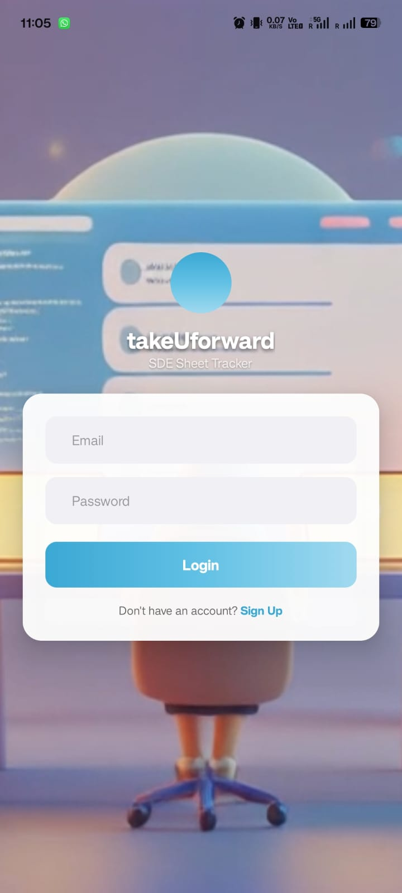
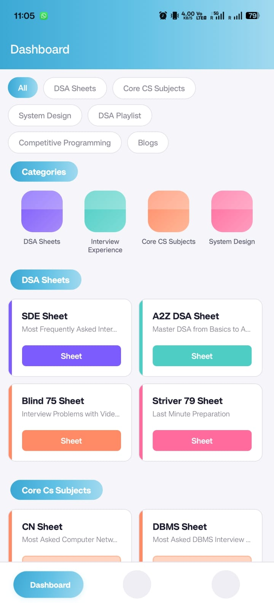
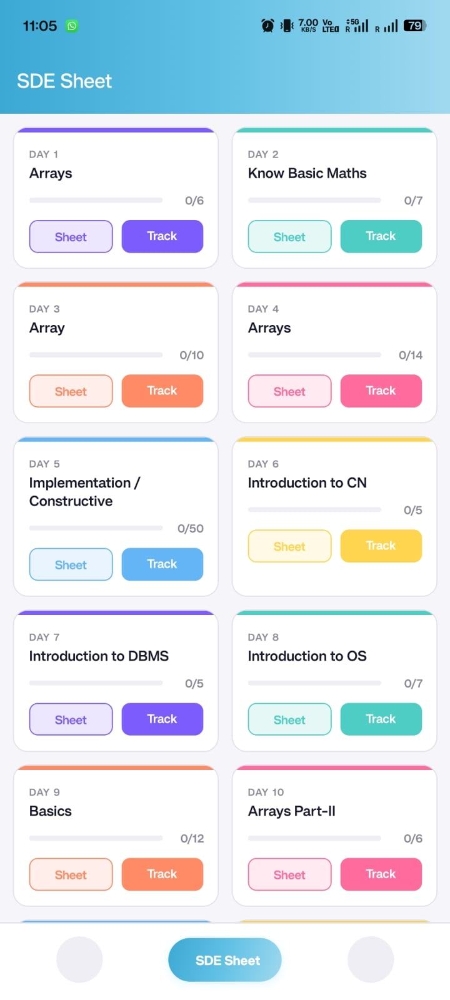
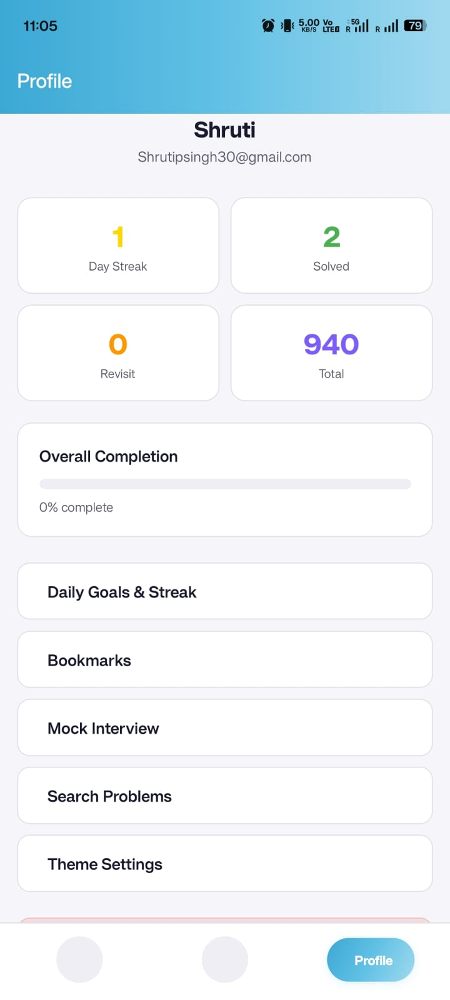

# SDE Tracker

A React Native Android app for DSA preparation built around Striver's **takeUforward** platform — aggregating **940+ problems across 9 sheets** into a single tracker with progress, hints, and mock interviews.

## Download

[**Download APK**](https://github.com/Shrutis3004/sde-tracker-frontend/releases/download/v1.0.0/sde-tracker.apk)

[**Watch Demo (Screen Recording)**](https://drive.google.com/file/d/1ciJ0CI4zExEzdHsCsKYPEe6omkxT3Zyt/view?usp=sharing)

## Features

- **9 Striver Sheets** — SDE Sheet, A2Z DSA, Blind 75, Striver 79, CP Sheet, CN, DBMS, OS, System Design
- **Progress Tracking** — mark problems as Solved / Revisit / Unsolved
- **AI Hints** — 3 progressive hints per problem to guide without spoiling
- **Mock Interview** — timed simulator with randomized problem sets
- **Daily Goals & Streaks** — GitHub-style heatmap to visualize consistency
- **Bookmarks** — save problems for quick access
- **Global Search** across all 940+ problems
- **Difficulty Filter** — Easy / Medium / Hard with one tap
- **Personal Notes** on each problem
- **28 Blog Categories** linked directly to takeUforward articles
- **Dark / Light Theme** with full color customization
- **App Tour** for first-time users
- **Responsive** — works on mobile and desktop

## Screenshots

<p align="center">
  
  
  
  
</p>

## Tech Stack

- **React Native** (Expo)
- **AsyncStorage** for offline persistence
- **AI Hints API** for progressive hint generation
- JavaScript / TypeScript

## Getting Started

```bash
git clone https://github.com/Shrutis3004/sde-tracker-frontend.git
cd sde-tracker-frontend
npm install
npx expo start
```

## Author

**Shruti Singh** — [GitHub](https://github.com/Shrutis3004) · [LinkedIn](https://www.linkedin.com/in/shruti-singh-s2211)
